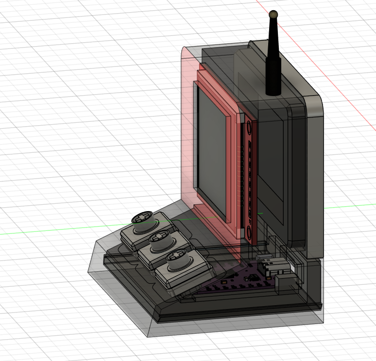
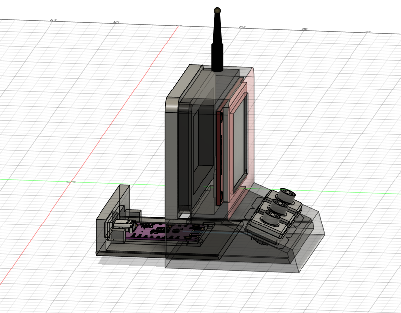
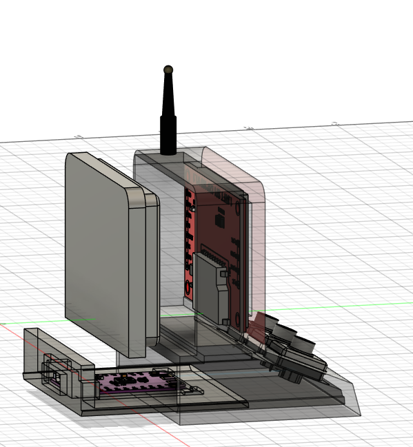

# Project-Play

## retro spotify music controller
### have you ever wonderd to controll your music wothout touching your phone well i did so i build a old computer model spofity controlling device here how you can do it

esp32 have slider and display have a cover 
### Features
* play/puse
* forware skip
* backward skip

### software I used
* Fusion 360 (for cad desgin)
* VS-code (for programing)

### BOM used in this project
* Zynox - ESP32-C3 Super Mini WiFi + Bluetooth Development Board (microcontroller)
* REES52 1.8 inch SPI TFT LCD Display Module TFT Display Module (display)
* Cherry Low Profile Mechanical Switch (low profile key its perfect fit for this project)

### Importent 
you need to glue down the antina its for cool look 

### BOM table

| Component | Description | Amount | Links |
|----------|------------|------------|-----------------|
| Zynox ESP32-C3 Super Mini | WiFi + Bluetooth Development Board (microcontroller) | 1 | https://amzn.in/d/09MLe2sH | 
| REES52 1.8" SPI TFT LCD | TFT Display Module (display) |1 | https://amzn.in/d/00wIzzSZ |
| Cherry Low Profile Mechanical Switch (x3) | Low-profile keys (perfect fit for this project) |3| https://meckeys.com/shop/accessories/keyboard-accessories/key-switches/cherry-low-profile-mechanical-switch/ |
